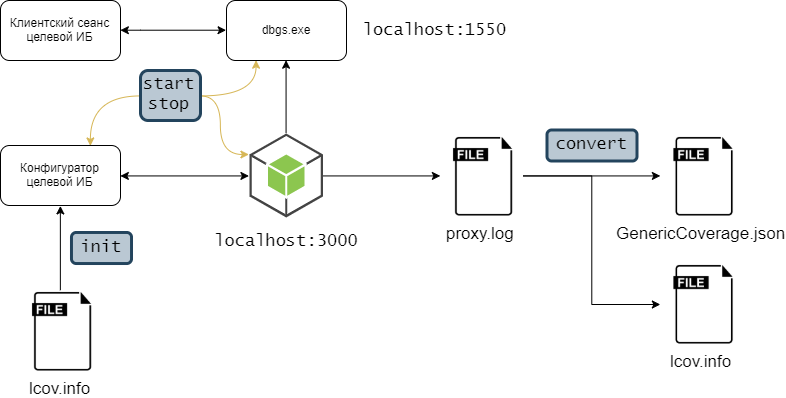

# onecover-nodeproxy

## Замер покрытия кода тестами 1С:Предприятия

### Состав библиотеки

- proxy - логирующий реверс-прокси для 1С
- 1coverage - приложение, которое управляет сбором замеров и конвертирует логи proxy в формат [genericCoverage](https://docs.sonarqube.org/latest/analysis/generic-test/) и lcov

### Принцип работы

Приложение `1coverage` состоит из четырех команд:

- init - команда, которая настраивает выбранную базу на протокол отладки http с подключением к проксирующему серверу
- start - команда начала сбора замеров. Выполняет следующие действия:
  - запускает сервера отладки 1С
  - запускает proxy
  - открывает конфигуратор
- stop - команда остановки сбора замеров. Выполняет следующие действия:
  - завершает замеры в конфигураторе
  - закрывает конфигуратор
  - останавливает proxy
  - останавливает сервер отладки 1С
- convert - команда конвертации накопленных логов отладки в различные форматы

### Требования к окружению

- ОС Windows
- платформа 1С версии не ниже 8.3
- node.js
- репозиторий с конфигурацией, выгруженной в формате XML или EDT
- проект в SonarQube, связанный с целевой конфигурацией

Библиотека сама поднимает экземпляр сервера отладки 1С во время работы, поэтому иметь отдельную службу не обязательно

### Как собирать замеры

Все операции должны выполняться под одним и тем же пользователем ОС.

#### Вручную

- установить библиотеку `1coverage`
- подготовить ИБ, на которой будут выполняться замеры покрытия
- добавить в локальный репозиторий файл настроек, отредактировать параметры
- указать путь к файлу с замерами в `sonar-project.properties`
- выполнить `1coverage init`
- в открывшемся конфигураторе запустить клиент 1С с отладкой
- выполнить автоматические тесты или любые действия интерактивно

> Перед выполнением действий, описанных ниже, клиент 1С должен оставаться открытым!

- выполнить `1coverage stop`
- выполнить `1coverage convert`
- выполнить `sonar-scanner`

#### На сервере сборки

- установить библиотеку `1coverage`
- добавить в репозиторий файл настроек, отредактировать параметры в нем или передать их через переменные окружения
- добавить в параметры запуска клиентов тестирования ключи для подключения к серверу отладки (см. документацию по используемому продукту)
- настроить принудительное завершение замеров (доступно в VA)
- указать путь к файлу с замерами покрытия в `sonar-project.properties`

- отредактировать скрипт сборки:
    -- после шагов по созданию тестовой ИБ добавить команду `1coverage init`
    -- перед выполнением тестов добавить команду `1coverage start`
    -- после выполнения всех тестов добавить команды `1coverage stop` и `1coverage convert`

- запустить билд

- убедиться, что в SonarQube появилась информация о покрытии

### Known issues

1) Из-за особенностей работы платформы 1С данные о покрытых строчках перехватываются только тогда, когда отладка остановлена явным образом: интерактивно в конфигураторе или с помощью специального запроса к серверу отладки. По этой же причине не собираются замеры в коде, который выполняется в фоновых заданиях, поэтому его надо запускать синхронно. В БСП для этого предусмотрен параметр `/РежимОтладки`.

2) Если нужная информационная база зарегистрирована более одного раза в списке информационных баз, то при выполнении команды `1coverage init` режим отладки будет установлен только для первой информационной базы в этом списке.

3) Если информационная база существует, но не зарегистрирована в списке информационных баз, то режим отладки будет установлен для всех баз с указанной строкой подключения.
